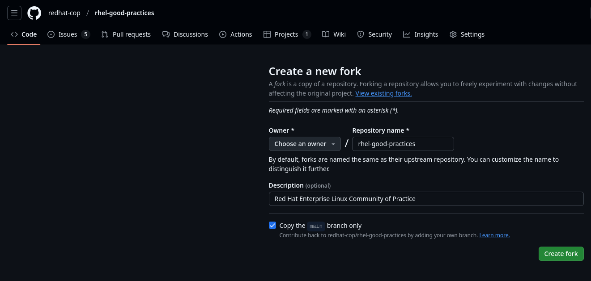

# Contributing to `redhat-cop/rhel-good-practices`

Welcome to the `redhat-cop/rhel-good-practices` repository! We appreciate your interest in contributing. This guide will walk you through the entire process of contributing to the project, from setting up your environment to submitting your changes.

---

## Table of Contents
1. [Getting Started](#getting-started)
2. [Setting Up Your Environment](#setting-up-your-environment)
3. [Making Changes](#making-changes)
4. [Creating a Pull Request](#creating-a-pull-request)
5. [Code Review Process](#code-review-process)
6. [Additional Resources](#additional-resources)

---

## Getting Started

Before you start contributing, make sure you have the following:
- A [GitHub account](https://github.com/join).
- Basic knowledge of Git and GitHub workflows.
- Familiarity with the project's purpose and guidelines (check the [README](https://github.com/redhat-cop/rhel-good-practices/blob/main/README.md)).

---

## Setting Up Your Environment

1. **Fork the Repository**:
   - Go to the [repository page](https://github.com/redhat-cop/rhel-good-practices).
   - Click the "Fork" button at the top right to create a copy of the repository under your GitHub account.
   
   - Proceed and create the fork.
   

2. **Clone Your Fork**:
   - Clone your forked repository to your local machine (replace YOUR-USERNAME with your GitHub username):
     ```bash
     git clone https://github.com/YOUR-USERNAME/rhel-good-practices.git
     cd rhel-good-practices
     ```

3. **Set Upstream Remote**:
   - Add the original repository as an upstream remote to sync changes:
     ```bash
     git remote add upstream https://github.com/redhat-cop/rhel-good-practices.git
     ```

4. **Sync Your Fork**:
   - Fetch the latest changes from the upstream repository:
     ```bash
     git fetch upstream
     ```
   - Merge the changes into your main branch:
     ```bash
     git checkout main
     git merge upstream/main
     ```

5. **Create a New Branch**:
   - Create a new branch for your changes:
     ```bash
     git checkout -b your-branch-name
     ```

---

## Making Changes

1. **Make Your Changes**:
   - Make the necessary changes to the code or documentation.
   - Follow the project's [coding standards and guidelines](./contribution-guidelines.md).

2. **Commit Your Changes**:
   - Stage your changes:
     ```bash
     git add .
     ```
   - Commit your changes with a clear and descriptive commit message:
     ```bash
     git commit -m "Your descriptive commit message"
     ```

3. **Push Your Changes**:
   - Push your changes to your forked repository:
     ```bash
     git push origin your-branch-name
     ```

---

## Creating a Pull Request

1. **Open a Pull Request**:
   - Go to your forked repository on GitHub.
   - Click the "Compare & pull request" button.
    
2. **Describe Your Changes**:
   - Provide a clear title and description for your pull request.
   - Reference any related issues using `#issue-number`.

3. **Submit the Pull Request**:
   - Click "Create pull request" to submit your changes for review.

---

## Code Review Process

- Maintainers will review your pull request and may request changes.
- If changes are requested, make the necessary updates and push them to your branch. The pull request will automatically update.
- Once your pull request is approved, it will be merged into the main repository.

---

## Additional Resources

- [GitHub Docs: Contributing to a Project](https://docs.github.com/en/get-started/exploring-projects-on-github/contributing-to-a-project)
- [GitHub Flow Guide](https://guides.github.com/introduction/flow/)
- [How to Write a Good Commit Message](https://chris.beams.io/posts/git-commit/)
- [Git Cheat Sheet](https://training.github.com/downloads/github-git-cheat-sheet/)

---

Thank you for contributing to `redhat-cop/rhel-good-practices`! Your efforts help improve the project for everyone. If you have any questions, feel free to reach out to the maintainers.

Happy contributing! 🚀
