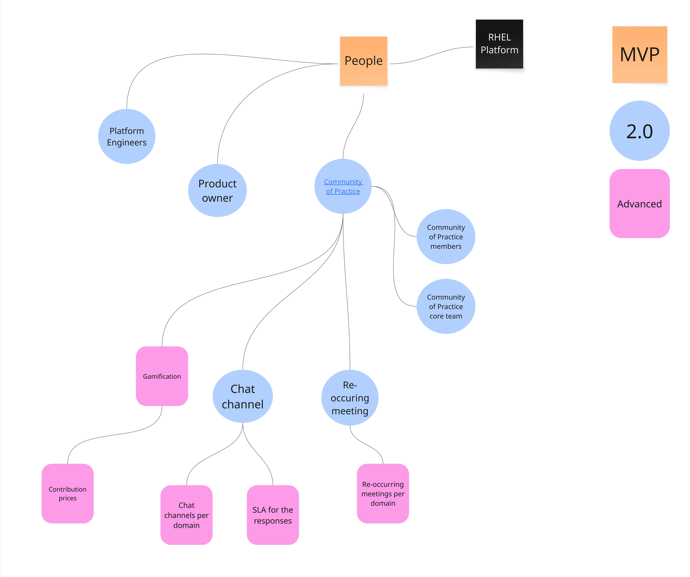
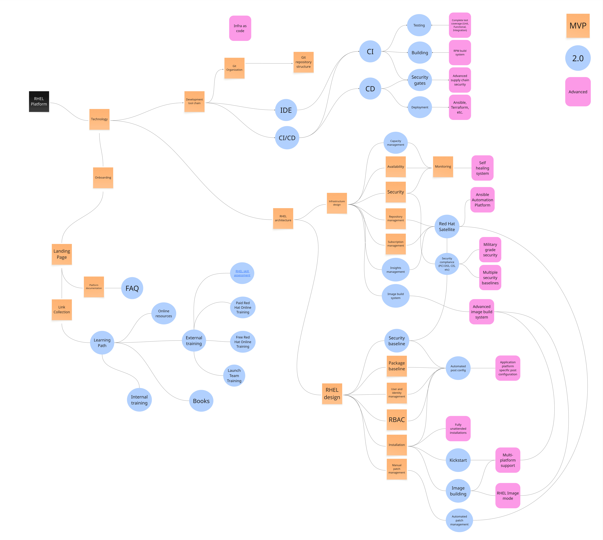

# Operational Model - RHEL - Advanced
If you are wonder what an operational model is, [you should start by reading this introduction](intro.md).

# Overview
Zoom into this picture for details.

# People
Overview of the process section. Zoom into this picture for details.

* **Solution architects** - To offload the many discussions on how to do different things with your operating system platform, it makes a lot of sense to have one or several Solution Architects which focuses on helping users implement their systems.  

## Community of practice
There are many different names for this, for example Centre of Excellence, DevOps Dojo, or etc. It's simply a community which you build around your platform. Here we describe resources related to people and your community.

* **Gamification** - You have implemented gamification practices which boosts contribution in your community.
* **Contribution princes** - You celibrate contribution to the degree that you have a small budget for contribution prices.
* **Chat channels per domain** - Your community has grown so large that you now need to split chat channels per technical domain.
* **Re-ocurring meetings per domain** - Your community is too large for a single community of practice meeting. You also now have meeting specific for special technical domains such as cloud, specific security.
* **SLA for responses** - To ensure that people are not left in a vaccum with their problems, you aim to answer all questions in your chat chanels within a specific time.

## RHEL Platform processes
Processes related to the Red Hat Enterprise Linux standard platform itself.

## Onboarding process
An overview of a common onboarding process can be viewed below. Please note that the graphics describes all three advancement levels of onboarding.

The steps for the Advanced version of the onboarding follows:

* **Skill based training** (Onboarding for experienced/un-experienced) There is a specific onboarding process for people who are already experienced with modern development practices and Red Hat Enterprise Linux. This allows highly experienced individuals to get started more quickly.

## Development processes
Processes related to the development of your RHEL platform.

* **Infra as code** - As you develop and define your RHEL Platform, you use infrastructure-as-code concepts. This is a requirement to allow for advanced controls of the development and security of the standard.
* **Complete test coverage (Unit, Functional, Integration)** - All aspects of your standards is covered by tests. This allows you to quickly pinpoint complex issues as your develop your standard, inroduce new major releases and more.
* **Continous deployment and testing of platform** - When you make a change to your standard, it automatically deploys test instances and performs testing on them. This allows you to navigate complicated issues in the standard where something breaks further down the line.
* **Automated RPM builds** - You have an automated RPM build system which ties into the automatic and continous deployment and testing of your platform.
* **Advanced supply chain security** - The development process of your standard has advanced security compliance such as [SLSA Level 3](https://slsa.dev/).
* **Ansible, Terraform, etc** - To deploy a complete fresh instance of your RHEL platform in an automated fashion you do well in using an automation framework, such as Ansible or Terraform.

# Technology
Overview of the technology section. Zoom into this picture for details.

## RHEL architecture
Architectural decisions related to Red Hat Enterprise Linux.

### Infrastructure design
Infrastructure related decisions.

* **Self healing system** - The installed instances of RHEL will self heal in case of known issues related to Availability or Security are detected. This can be accomplished with things such as Event Driven Ansible which is a part of Ansible Automation Platform, or 3rd party SIEM or monitoring platforms.
* **Ansible Automation Platform** - Your requirements for automation and scale of your installed base of RHEL instances means that you would be well off in investing in a general purpose automation platform. The most popular configuration management tool is Ansible, and [the premier central automation platform is called Ansible Automation Platform.](https://www.redhat.com/en/technologies/management/ansible). This allows your to streamline development of your platform, moving automation previously defined elsewhere, as Ansible automation. It will also decrease overall technical risk for your platform and allow you to focus your time on things which matters more.
* **Military Grade Security** - Security standards such as CIS Level 2 are not good enough. Creating automatic hardening which can withstand persitent threat groups requires the most strictest security hardening, including SELinux MLS mode, Integrity Measurement Architecture, etc, and agressive automatic security responses.
* **Advanced image build system** - When you need to support a broader range of RHEL installation images, you need to invest more in your image build system. It needs to be able to continously generate images, also integrated to your automatic RPM build system - if you have one.
* **Multiple security baselines** - To support more diverse security requirements, you may have to add multiple security baselines to provide a more broad spectrum of compliance. This is challenging as it may spawn many more images or kickstarts which you need to create and maintain. As an example: If you maintain specific installation images for two different technical platforms, let's say: Public Cloud A, and Baremetal, you may now get Public Cloud A - Compliance A, Public Cloud A - Compliance B images, and so on.

### RHEL design
Design of your Red Hat Enterprise Linux standard.

* **Application platform specific post configuration** - Your platform automatically applies post configuration specific to different application platforms such as different databases, application servers, etc.
* **Fully unattended installations** - When a new instance of your standard starts up, nothing more is needed to be done as it relates to your platform. That includes configuring all related systems, such as CMDB systems, change management systems, and so on.
* **Multi-platform support** - You support multiple hardware-, virtualization- and cloud platforms.
* **RHEL Image mode** - Your RHEL platform also supports RHEL Image mode.

## Development tool chain
Features related to the development tool chain.

* **Complete test coverage (Unit, Functional, Integration)** - You need tools which supports the complete testing of your platform. That can be done using the automation, infra as code and CI/CD features of your platform. It may also be accomplished with 3rd party tools test platforms.
* **RPM Build system** You need a system which can automatically build RPMs. Either a custom implementation using rpm-build tools, mock, or a more proper platform such as [Koji](https://koji.build/).
* **Advanced supply chain security** - You need to select tools such can support advanced supply chain security standards such as [SLSA](https://slsa.dev).
* **Ansible, Terraform, etc** - You need more advanced automation capabilities to be able to automatically deploy your standard, such as Ansible or Terraform.
